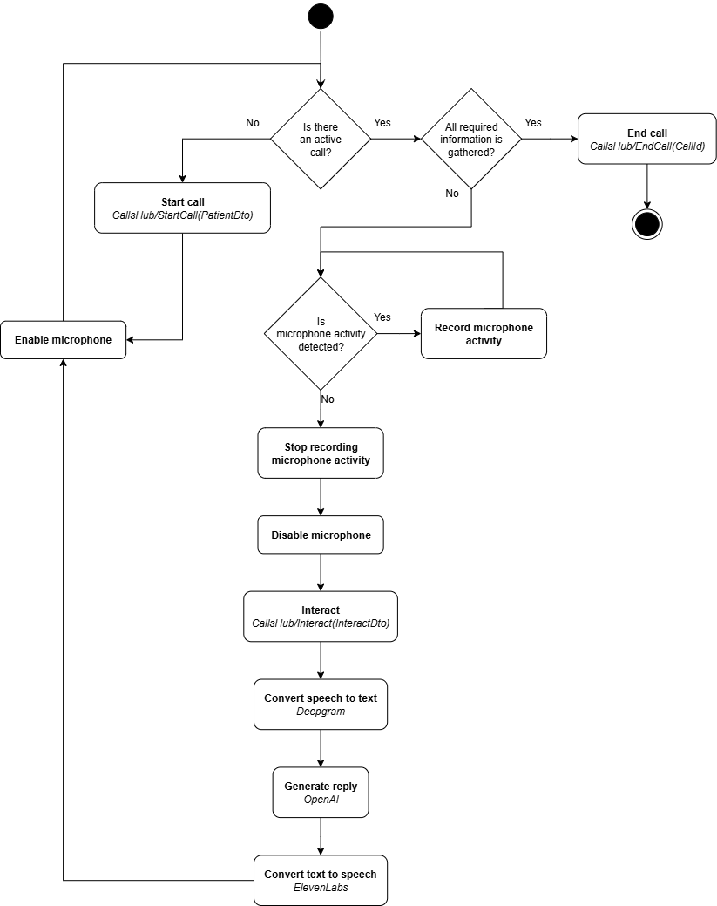

# Spike Interview


## Assignment
Build a self-contained voice pipeline that lets a user pretend to be an insurance provider at “Best Health Insurance” and the AI agent has to represent “Spike Clinical” and verify coverage details for some patient.

Full assignment description can be found [here](Assignment.pdf) (API keys not present).


## Setup Instructions

### Building Docker image
In the root directory of the solution, run the following command:
```
docker build -t spike .
```

### Launching Docker image
Replace the values of API keys with corresponding keys.

```
docker run -e ASPNETCORE_ENVIRONMENT=development -e DEEPGRAM_API_KEY={DEEPGRAM_API_KEY} -e ELEVENLABS_API_KEY={ELEVENLABS_API_KEY} -e OPENAI_API_KEY={OPENAI_API_KEY} -p 5000:5000 spike
```


## Usage

1. Turn on [http://localhost:5000/index.html](http://localhost:5000/index.html) in your browser.
2. Enable the microphone.
3. Enter information about the patient, whose details have to be collected from the insurer.
4. Click _"Start Call"_ button to begin the conversation.
5. Have a conversation with the Spike Clinical's assistant
6. Click _"End Call"_ at the end of the conversation.
7. After the conversation, you will be presented with the collected information about the patient.

Notes:
- Application detects microphone usage and sends the audio for the processing once the silence is detected.
- The conversation is synchronous, meaning that the microphone is not recording while the request is being processed or generated voice message is being played.


## Design Decisions
- The communication between UI and the server is happening using the SignalR library
  - This allows to have a mechanism for notifying UI from the backend
- 3rd party APIs are called via the API endpoints
  - It does not allow real-time feel of the conversation. 
  - That makes the communication with APIs slower.
  - This decision was made as I'm lacking experience with real-time processing, but willing to learn :)
- Microphone is disabled while the voice input is being processed and voice output is being played
  - Before this decision, silence was being detected as non-silence and triggered calls to agent and that made the agent respond while I was speaking. That made the communication with agent impossible.
  - Decision was made due to the lack of experience with voice detection (to better distinguish what is silence) and with real-time systems
- Calls are persisted in memory
  - There's no call history after restart of the application. 
  - But I hope that's fine for PoC purposes :)
- Prompts are persisted in files and cached in memory
  - So that they could be edited on the fly, without the deployment of application
  - Or they could be stored in some API for easier editing.
- Failed calls to 3rd party APIs are retried as they are critical for the quality of a call
  - Currently, all types of exceptions are being handled, but for production-grade code it would be needed to retry only on transient exceptions
- The code is structured using Clean Architecture principles.
- Voice ids are currently stored in the frontend
  - This is just for PoC and better user experience
  - For the long term solution, voice details should be fetched from the server 


## Future Improvements
- Implement real-time processing for more "live" conversation
  - Using streaming endpoints of 3rd party APIs instead of rest ones
  - Streaming the audio to/from server instead of sending big chunk of data
- Make the conversation feel more natural
  - Adjust with voice settings.
  - Add some background noise, so that bot's voice does not feel so plain.
- Implement fallback mechanisms for failed 3rd party API calls
  - e.g. if one STT provider is not working (e.g. network issues), then use another one
- Add persistence for long-time storage.
  - Also that enables scalability by allowing deployment of multiple instances of the application (but still using same data source)
- Add background call activity monitoring
  - e.g. there is no activity from the insurer, the Agent could ask _"Are you still there?"_
- Add metrics
  - Technical metrics (request count, duration, statuses, etc.)
  - Business metrics
- Add monitoring
  - Based on the metrics, create the monitors that would alert if something is not wrong.
- Unit test internal 3rd party API clients
  - 3rd party API clients are provided as classes (not interfaces) and they cannot be mocked.
- Integration tests
  - Testing Repositories (that various queries, mappers, etc. are valid)
  - SignalR Hubs (that hub works properly)
- Benchmarking and performance improvements
  - In order to make conversations as live as possible
- Fetch voices from the server instead of storing them in the frontend

## Diagrams

### Activity
This section presents activity diagram of the application.

Main parts are:
- _"Start Call"_, which captures the details about the patient and inserts them into the initial LLM prompt.
- _"Interact"_, which executes the processing pipeline: `STT -> LLM -> TTS`
- _"End Call"_, which summarizes the call and persists the collected information.


